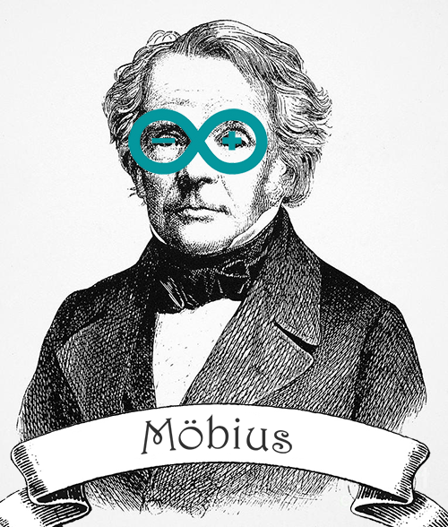

<table>
<tr>
	<td></td>
	<td>
		<h1>Features</h1>
		<ul>
			<li>Event-driven architecture</li>
			<li>Maximum abstraction</li>
			<li>Demonstrativeness and ease of assembly</li>
			<li>Visual effects</li>
			<li>No delays!</li>
		</ul>
		<p>&nbsp;</p>
		<p>&nbsp;</p>
		<p>&nbsp;</p>
		<p>&nbsp;</p>
		<p>&nbsp;</p>
	</td>
</tr>
</table>


---


<a name="example"></a>
A very simple example
=====================

See http://youtu.be/Y4l9nhQlWT0

```c++
#include <Mobius.h>

using namespace Mobius;

LED *led = new LED(10);
LED::Array *indicator = LED::Array::range(2, 9);

Power *power = new Power(500); // duration, ms
Button *btn = new Button(11);

void setup() {
	led->setEffect(new Effects::Blink(500));

	power->attach(indicator);
	btn->attach(power);

	power->bind(Power::PRGORESS, &handleEvent);
}

void handleEvent(int id) {
	switch (id) {
		case Power::VALUE:
			if (power->value == 1) {
				led->on();
			} else if (led->value) {
				led->off();
			}
			break;
	}
}

void loop() {
	Mobius::strip();
}
```


---


### Using motor

```c++
#include <Mobius.h>

using namespace Mobius;

Button *btn = new Button(2);
Motor *motor = new Motor(3, 4);
Power *acceleration = new Power(1000);

void setup() {
	motor->setDirection(Motor::CW);
	acceleration->attach(motor);
	btn->attach(acceleration);
}

void loop() {
	Mobius::strip();
}
```


---


### Сomponents

 * [LED](#LED)
 * [LED::Array](#LEDArray)
 * [Button](#Button)
 * [Power](#Power)
 * [Motor](#Motor)
 * [Sensor::Ultrasonic](#SensorUltrasonic)


---


<a name="LED"></a>
#### LED

 * `on()` — turn on (1)
 * `off()` — turn off (0)
 * `setValue(float value)` — set brightness `0..1`
 * `getValue()` —  get brightness `0..1`
 * `setEffect(Effects::Effect *effect)`

```c++
byte pin = 13;
LED *led = new Led(pin);

// Add fade effect
led->setEffect(new Effects::Fade(500, 300)); // 500ms — fadeIn, 300ms - fadeOut

// Or blinking effect
led->setEffect(new Effects::Blink(150)); // 150ms — interval between blinks

// Turn on
led->on();
```


---


<a name="LEDArray"></a>
#### LED::Array

```c++
byte startPin = 2;
byte endPin = 12;
LED::Array *bar = LED::Array::range(startPin, endPin);

// Turn on
bar->on();

// Enable only half
bar->setValue(0.5);
```


---


<a name="Button"></a>
#### Button

 * `pressed:bool` — state `true` или `false`
 * `attach(Pin *pin)`
 * `bind(int eventId, void *callback(int))` — add event listener: `Button::DOWN` or `Button::UP`

```c++
byte pin = 10;
Button *btn = new Button(pin);

// Turn on LED by pressing the button
btn->attach(new LED(13));

// Add event listener
btn->bind(Button::DOWN, &handleEvent);
```

---


<a name="Power"></a>
#### Power

```c++
Power *power = new Power(3000); // 3000ms — 0 to 1
Button *btn = new Button(13);

power->attach(LED::Array::range(1, 10));
btn->attach(power);
```


---


<a name="Motor"></a>
#### Motor
Support L298N.

```c++
Motor *motor = new Motor(2, 3);

motor->setSpeed(1); // max
motor->setSpeed(0); // stop

motor->setDirection(Motor::CW); // OR `Motor::CCW`
```


---


<a name="SensorUltrasonic"></a>
#### Sensor::Ultrasonic
Support HC-SR04.

```c++
Sensor::Ultrasonic *sonar = new Sensor::Ultrasonic(2, 3);

// Subscribe to the change in distance
sonar->bind(Sensor::Ultrasonic::DISTANCE, &handleEvent);

// Current distance
sonar->value; // cm
```


---


### Installation
 1. [Download the Arduino Software](http://www.arduino.cc/en/Main/Software)
 2. Run IDE
 3. Clone this repository: `git@github.com:RubaXa/Mobius.git`
 4. `cd Mobius`
 5. `make all` (Create a `Mobius.zip`)
 6. IDE: [Sketch] > [Include Library] -> [Add .ZIP Library]
 7. Enjoy!


```c++
#include <Mobius.h>

using namespace Mobius;

// Variables

void setup() {
	// Logic
}

void loop() {
	Mobius::strip();
}
```


---


### MIT LICENSE
